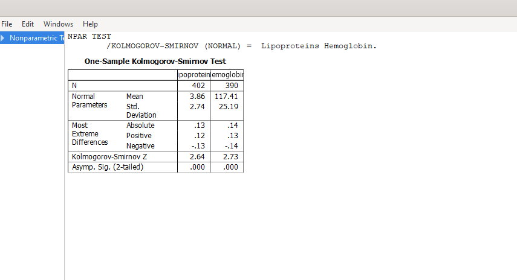
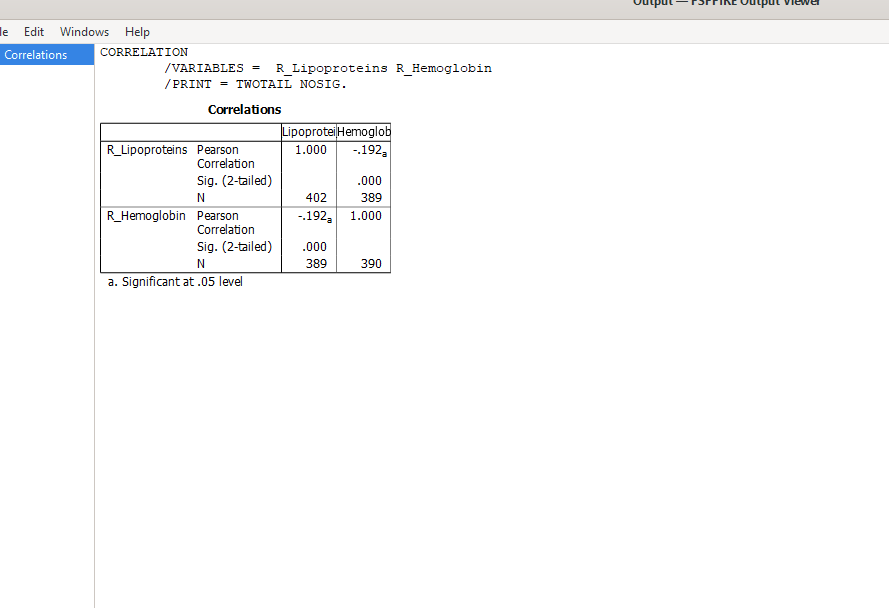

# Практичне заняття №11 — Кореляційний аналіз

**Дисципліна:** Теорія ймовірностей та математична статистика  
**Тема:** Кореляційний аналіз  
**Група:** АІК-43  
**Виконав:** Вівчар Вадим  

## Мета роботи

Навчитись визначати тип та тісноту взаємозв’язку між випадковими змінними, обирати метод кореляційного аналізу та робити висновок за отриманим коефіцієнтом кореляції.

## Файли репозиторію

### Звіт

- [Готовий PDF-звіт](practical_work_11_correlation_analysis.pdf)

### Дані

- [Початкові дані для аналізу](correlation_data.csv)
- [Дані з ранговими змінними](correlation_data_with_ranks.csv)

### Команди PSPP

- [Файл із командами аналізу PSPP](analysis_commands.sps)

### Скріншоти виконання

- [Скріншот 1 — Вхідні дані](01_input_data.png)
- [Скріншот 2 — Діаграма розсіювання](02_scatterplot.png)
- [Скріншот 3 — Перевірка нормальності](03_kolmogorov_smirnov.png)
- [Скріншот 4 — Результат кореляції Спірмена](04_spearman_result.png)

## Хід виконання роботи

1. Дані було імпортовано у PSPP з CSV-файлу.
2. Побудовано діаграму розсіювання для змінних `Lipoproteins` та `Hemoglobin`.
3. Перевірено нормальність розподілу за критерієм Колмогорова-Смірнова.
4. Оскільки нормальність розподілу не підтвердилась, для подальшого аналізу використано коефіцієнт рангової кореляції Спірмена.
5. У PSPP коефіцієнт Спірмена було розраховано через кореляцію між ранговими змінними `R_Lipoproteins` та `R_Hemoglobin`.

## Пруфи виконання

### 1. Вхідні дані

### 2. Діаграма розсіювання

### 3. Перевірка нормальності розподілу

### 4. Результат кореляційного аналізу

## Результати

За результатами аналізу отримано:

- коефіцієнт кореляції: **r = -0.192**;
- значущість: **p = 0.000**;
- кількість парних спостережень: **N = 389**.

## Висновок

Між змінними `Lipoproteins` та `Hemoglobin` виявлено слабкий зворотний статистично значущий зв’язок. Оскільки коефіцієнт кореляції має від’ємне значення, зі зростанням однієї змінної інша має слабку тенденцію до зменшення.

Отже, між рівнем ліпопротеїнів та гемоглобіну існує слабкий негативний статистично значущий взаємозв’язок.
